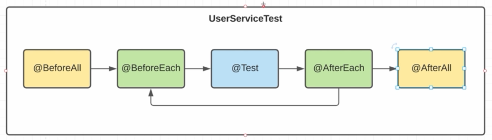
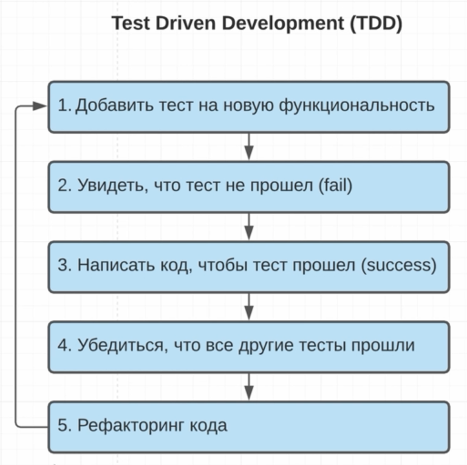
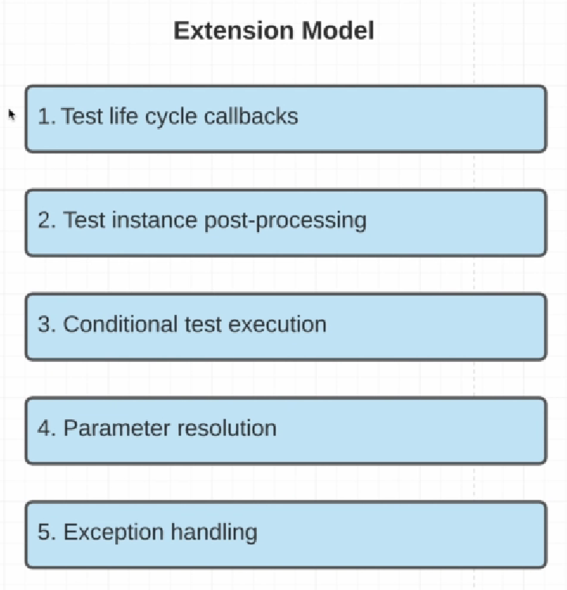

## Введение
**Тестирование ПО** - это процесс испытания программы, целью которого является определить соответствие между **ожидаемым** поведением и **актуальным** с помощью набора тестов

Тестирование необходимо не только для проверки нового функционала, но и работоспособности старого (**регрессивное теситрование**)

Уровни тестирования:

1. Unit testing
2. Integration testing
3. Acceptance testing

**Unit testing** - тестирование маленького компонента приложения (функции), т.е. этот **unit** должен правильно отрабатывать в изоляции от других компонентов.

**Integration testing** - тестирование нескольких компонентов приложения (функции), т.е. как маленькие units работают вместе как один большой unit.

**Acceptance testing** - тестирование всего приложения в целом, т.е. как оно работает со стороны пользователя (**функциональное тестирование**).

JUnit5 - это один из самых распространенных java фреймворков, который предназначе для написания в основном Unit и Integration тестов

Для написания **Acceptance** тестов обычно используют другие тест фреймворки, например: JBehave, TestNG.

Junit5 разбит на несколько основных зависимостей

- JUnit Platform - запуск тестов на JVM, интеграция с Maven, Gradle, IDE, фреймворками.

- JUnit Jupiter - предоставляет набор классов, которые разработчики используют для написания тестов. API для программистов.

- JUnit Vintage - интеграция с предыдущими версиями JUnit3, JUnit4

Так же нужна Java выше 1.8

mvn -N io.takari:maven:0.7.7:wrapper -Dmaven=3.6.3 - для установки maven wrapper.

## Аннотация Test-Assertion

Все тесты, согласно конвенции должны находиться в папке src/test

Название тест-классов должно заканчиваться на Test, так maven-surefire-plugin поймёт, что их нужно отслеживать.

В JUnit5 классы тестов могут быть не public (как в JUnit4), а package-private.

maven-surefire-plugin раньше искал методы с постфиксом Test, теперь же достаточно поставить аннотацию @Test.

TDD - Test Driven Development - сначала пишем тест, потом функционал.

Название теста должно отображать функционал. Можно использовать snake-case.

В пакете Assertions есть много разных aasertов: assertTrue, assertFalse, assertEquals, AssertListEquals и так далее.

Но их бывает недостаточно, тогда можно подключить сторонние библиотеки Assertj, Hamcrest

## Test LyfeCycle



Порядок вызова тестов не гарантирован, поэтому они должны быть независимыми.

Методы @BeforeAll и @AfterAll должны быть static. Так как они выполняются только один раз для всех тестов.

По умолчанию у нас есть жизненный цикл тестов, его можно задавать через @TestInstance. Для LifeCycle.PER_METHOD 
@BeforeAll и @AfterAll должны быть static т.к. на каждый тест создаётся новый объект UserServiceTest.

Для LifeCycle.PER_CLASS создаётся один объект UserServiceTest и нет необходимость делать @BeforeAll и @AfterAll static.

## Запуск тестов Launcher API


При подключении зависимости junit-jupiter-engine транзитивно предоставляется junit5-API.

Так же транзитивно подключается общий API для всех тестов JUnit Engine API (junit-platform-engine).

Тесты запускаются в Idea, либо в maven(urefire-plugin - goal test), либо в gradle(task - test). <br>
Они используют JUnit Launcher (junit-platform-launcher).

JUnit Launcher в свою очередь запускает JUnit Engine API для проверки тестов

#TDD - Test Driven Development



В процессе разработки ПО сначала пишем тесты, а затем функционал, который покрываем этими тестами.

Аннотация @Value lombok переопределяет equals() и hashcode().

## Assertj and Hamcrest

Executable - функциональный интерфейс аналогичный Runnable, но пробрасывает exception.

assertAll - проверяет все assertы, в отличии от набора, когда если один assert падает, то до других проверка не доходит.

В hamcrest в assertThat передается объект и matcher<br>
MatcherAssert.assertThat(users, IsMapContaining.hasKey(IVAN.getId()));

## Testing exceptions

В junit4 пробрасывание exceptions проверялось аннотацией<br>
@org.junit.Test(excepted = IllegalArgumentException.class)

## Tagging and Filtering

В JUnit5 появилась возможность помечать тесты тегом @Tag. Тесты можно разделять по смыслу бизнес логики, либо unit и integration.<br>
Это полезно, когда нужно протестировать только часть системы и не ждать выполнения всех тестов.

В TestLauncher есть метод filters, в него передаются условия include и exclude по префиксу.

Команды для запуска Maven:<br>
**mvn clean test -Dgroups=login**<br>
**mvn clean test -DexcludedGroups=login**

## Test Order. Nested Tests

Порядок запуска тестовых методов не определен. Есть алгоритм, который запускает тестовые методы в классах в одном и том же порядке, но сам порядок не гарантирован.

@TestMethodOrder(MethodOrderer.Random.class)

MethodOrderer - интерфейс. Есть 5 реализаций

- MethodName - запуск в алфавитном порядке названий методов

- DisplayName - задаём аннотацию @DisplayName, если не задана, то совпадает с названием метода. Сортировка по DisplayName.

- OrderAnnotation - все тесты помечаются аннотацией @Order(value), где нет аннотация - неопределенный порядок

- Random - каждый раз случайный порядок

Тестовые методы можно делить по смысловой на Nested classы с помощью конструкции

```java
 @TestMethodOrder(MethodOrderer.DisplayName.class)
    @Nested
    @DisplayName("test user login functionality")
    @Tag("login")
    class LoginTest {

        @Test
        void testMethod {
            
        }
    }
```

## Dependency Injection

Начиная с JUnit5 появилась возможность DI.

В JUnit5 появилась возможность создавать конструтор тестового класса. Ранее должен был быть один конструктор без параметра.

DI можно использовать для всех аннотаций(этапов) жизненного цикла теста.

Для обеспечения работы этого механизма есть специальный интерфейс:

```java
@API(
    status = Status.STABLE,
    since = "5.0"
)
public interface ParameterResolver extends Extension {
    boolean supportsParameter(ParameterContext var1, ExtensionContext var2) throws ParameterResolutionException;
    // вызывается в начале, DI Framework определяет, подходит ли данный параметр под ParametrResolver и возвращает true/false

    Object resolveParameter(ParameterContext var1, ExtensionContext var2) throws ParameterResolutionException;
    // если подходит то вызывается этот метод и возвращает объект нужного класса.
}
```

Из ParametrContext можно получить всю информацию о параметре.

Из ExtensionContext всю информацию о методе, куда производится внедрение зависимости. Это осуществляется с помощью 
Reflection API.

Для внедрения зависимостей нужно создать свою реализацию данного интерфейса и указать путь, где его искать.

```java
@ExtendWith(
        UserServiceParamResolver.class
)
public class UserServiceTest { ... }
```

UserServiceParametrResolver создаётся один раз, по типу Singleton, то есть можно предусмотреть механизм кэширования возвращаемого объекта.

Кэширование осуществляется с помощью инструмента extensionContext.getStore() в него передаётся NameSpace - ключ для hashmap.

```java
   @Override
    public boolean supportsParameter(ParameterContext parameterContext, ExtensionContext extensionContext) throws ParameterResolutionException {
        return parameterContext.getParameter().getType() == UserService.class;
    }
// Один и тот же объект UserService
  @Override
    public Object resolveParameter(ParameterContext parameterContext, ExtensionContext extensionContext) throws ParameterResolutionException {
         Store store = extensionContext.getStore(Namespace.create(UserService.class));
        return store.getOrComputeIfAbsent(UserService.class, it -> new UserService());
    }
```

```java
    // Разные объекты UserService
    public Object resolveParameter(ParameterContext parameterContext, ExtensionContext extensionContext) throws ParameterResolutionException {
         Store store = extensionContext.getStore(Namespace.create(UserService.class));
        return store.getOrComputeIfAbsent(extensionContext.getTestMethod(), it -> new UserService()); 
        // для каждого метода своё название, значит уникальный ключ и новый объект класса UserService
    }
```

## Parameterized test

В начале подключаем зависимость **junit-jupiter-params**

Параметризованный тест позволяет закрыть сразу несколько тестовых кейсов.

Вместе с аннотацией @ParametrizedTest используется аннотация @ArgumentsSource(). Она предоставляет аргументы в тест. 

Есть ряд определенных ArgumentProvider: @NullSource, @EmptySource - только для одного аргумента.

```java


  @TestMethodOrder(MethodOrderer.DisplayName.class)
    @Nested
    @DisplayName("test user login functionality")
    @Tag("login")
    class LoginTest {

 @ParameterizedTest(name = "{arguments} test")
//        @NullSource
//        @EmptySource
//        @NullAndEmptySource
//        @ValueSource(strings = {
//                "Ivan", "Petr"
//        })
        @MethodSource("com.dmdev.junit.service.UserServiceTest#getArgumentsForLoginUser")
//        @CsvFileSource(resources = "/login-test-data.csv", delimiter = ',', numLinesToSkip = 1)
//        @CsvSource({
//                "Ivan,123",
//                "Petr,111"
//        })
        void loginParametrizedTest(String username, String password, Optional<User> user) {
            userService.add(IVAN, PETR);

            Optional<User> maybeUser = userService.login(username, password);
            assertThat(maybeUser).isEqualTo(user);

        }
    }

    //Нельзя создать статический класс внутри nested-класса.

    static Stream<Arguments> getArgumentsForLoginUser() {
        return Stream.of(
                Arguments.of("Ivan", "123", Optional.of(IVAN)),
                Arguments.of("Petr", "111", Optional.of(PETR)),
                Arguments.of("Ivan", "dummy", Optional.empty()),
                Arguments.of("dummy", "123", Optional.empty())
        );
    }
```

## Fluky test. Timeout

Fluky test - нестабильные тесты, могут упасть в рандомном месте, а при повторном запуске проходить. Может быть связано
с неправильной реализацией тестов, например завязанной на порядок их следования. Либо один тест вносит изменения в БД и не убирает их после себя, и следующий тест уже получает не корректный дата сет.

Такие тесты помечаются аннотацией @Disabled("Описание") - которая позволяет не запускать этот тест.

Другой способ избавиться от Flucky тестов аннотация @Repeatable(количество раз)

Timeout

```java
     @Test
        void checkLoginFunctionalityPerformance() {
            Optional<User> maybeUser = assertTimeout(Duration.ofMillis(200L), () -> {
                Thread.sleep(100L);
                return userService.login("dummy", IVAN.getPassword());
            });
        }
```

assertTimeoutPreemptively - запуск Executable в отдельном потоке.

 @Timeout(value = 200, unit = TimeUnit.MILLISECONDS) - второй вариант Timeout.

 ## Extension model

 Ранее была аннотация @RunWith куда можно было передать свой Runner, чтобы изменить жизненный цикл теста.
 Это использовалось для тестирования различных фремворков, например Spring.
 Но это было очень трудоёмко, так как нужно было переписывать весь жизненный цикл теста.

 Часто на нужно внедриться только в одну фазу теста (BeforeAll и т.д.) для этого была введена аннотация @Rule. 
 Она была легковесной, но мы могли внедряться только после и перед аннотацией @Test.

 

 1. Благодаря CallBackам можем внедрится в любую жизненную стадию теста и добавить любой функционал.

 2. Возможность внести изменения после создания объекта тестового класса. Каждый раз по умолчанию создаётся новый объект класса UserServiceTest и вызывается метод @Test. Такую возможность использует Spring, чтобы внедрить свои зависимости в объект.

 3. Позволяет ввести условия на выполнение или невыполнение каких-либо тестов.

 4. Можем создавать свои Parameter resolution, чтобы внедрять свои зависимости в любые методы жизненного цикла теста.

 5. Можем отлавливать исключения, которые выбрасываются в процессе выполнения теста.

 В аннотацию ExtendWith нужно передать массив объектов наследующих Extension - интерфейс маркер, говорит о том, что мы можем использовать объекты типа Extension как модель для расширения наших классов.

 Существует множество интерфейсов, наследующих Exctension, которые покрывают все 5 пунктов Extension Model. Часто программисты не пишут сами реализации этих интерфейсов, а используют готове фреймворки и подключаются библиотеки. Такие как Moskito, Spring.

 ## Mockito Test Doubles

 Фреймворк Mockito позволяет делать заглушки на зависимые классы.

  

 В интеграционном тесте мы проверяем не только работу одного класса, но и его взаимодействие с другими классами.

 При создании Mock объекта, он наследуется от класса, который в него передаётся и переопределяет все его методы. При этом возвращаются по умолчанию дефолтные значения: false, 0, null, пустые коллекции и так далее.

 ```java
public class UserDaoMock extends UserDao{
    @Override
    public boolean delete(Integer userId) {
        return false;
    }
}
 ```

 При этом возникает ограничение - класс UserDao не может быть final.

 Таким образом приходим к двух основным способам создания mock - dynamic proxy 

 Mockito.doReturn(true).when(userDao).delete(IVAN.getId()); - это stub.

 Mockito.any() - dummy

 

